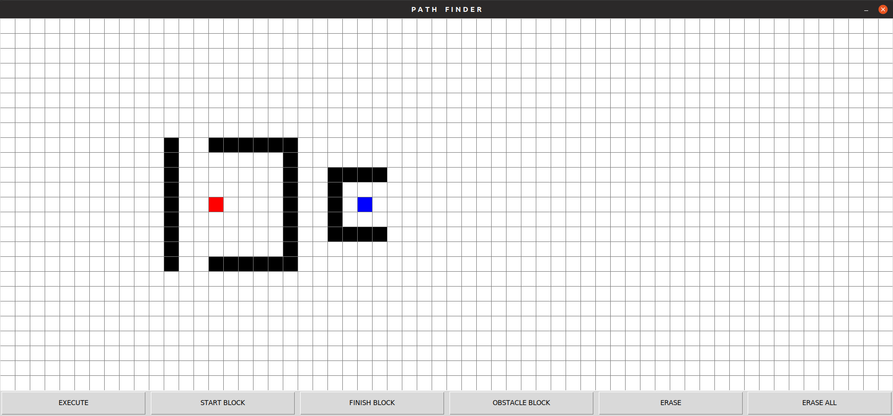

# Documentation

Animated algorithm responsible for finding shortest path between 2 points in a grid.

## Manual

1. draw *start* block 
2. draw *finish* block
3. draw *obstacle* blocks if you want
4. if something went wrong erase it
5. push *execute* button

